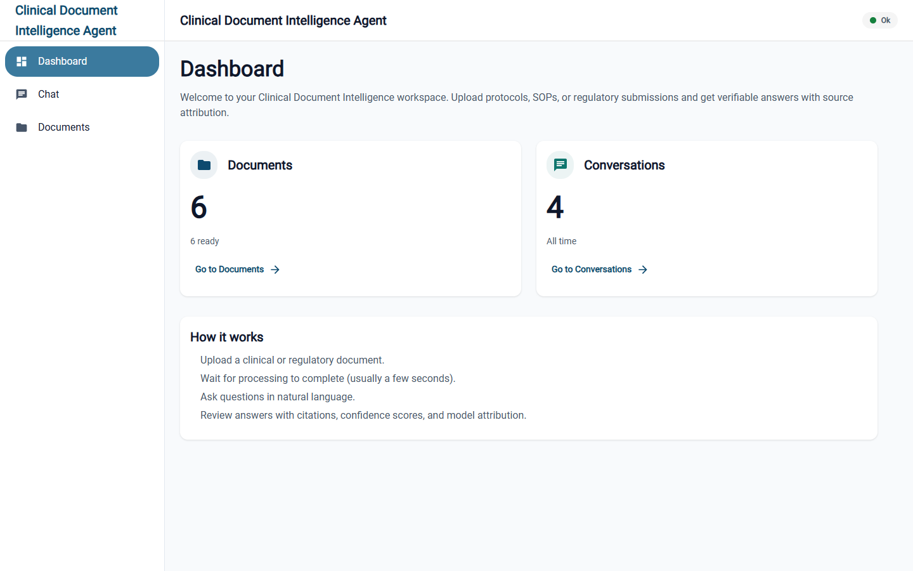
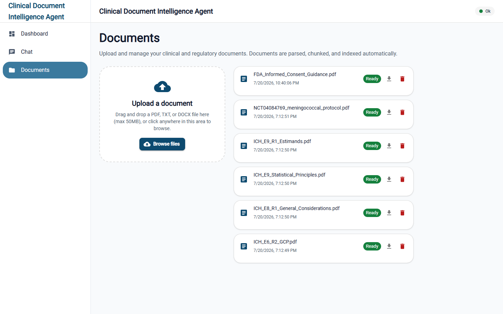
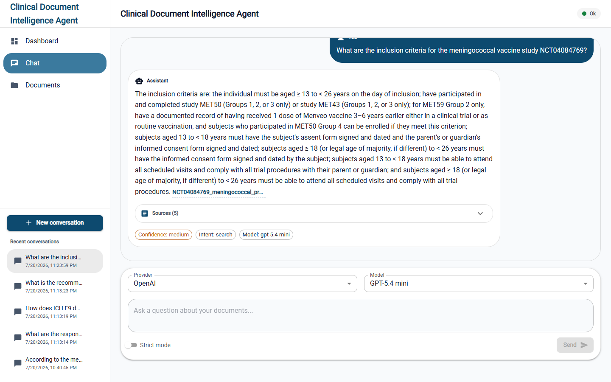
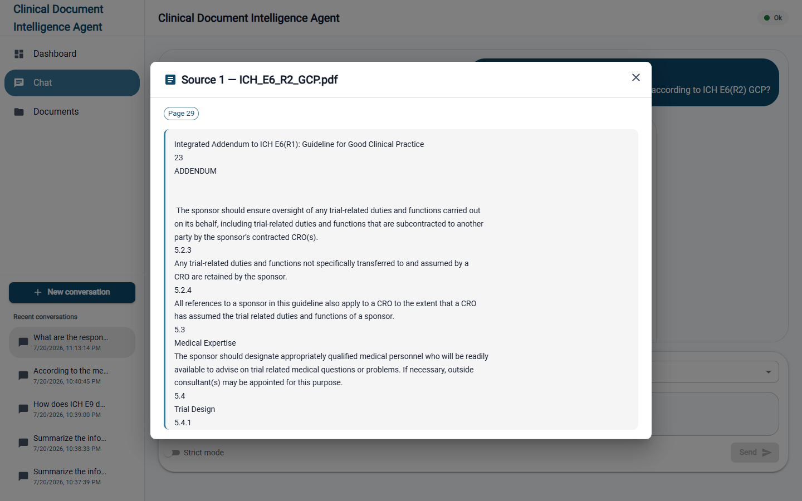
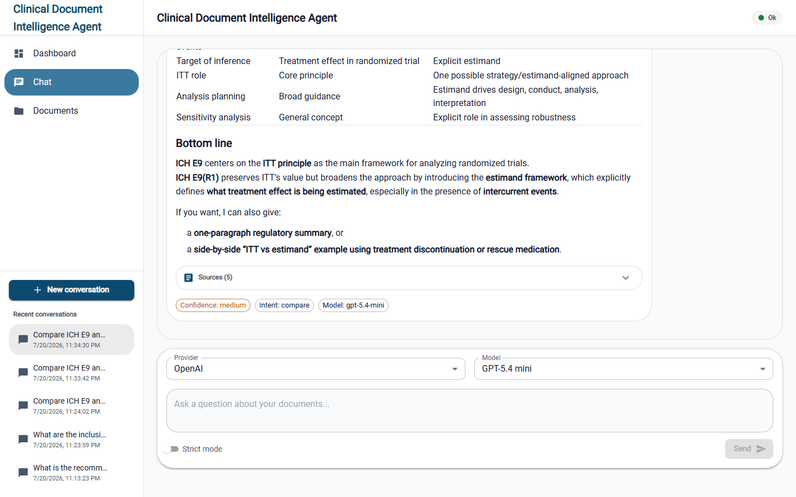
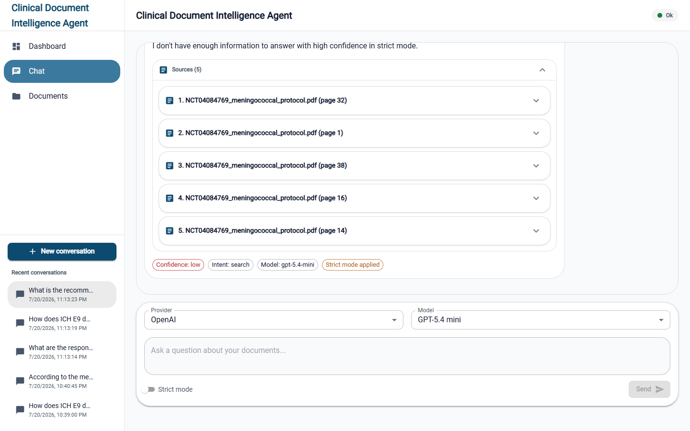
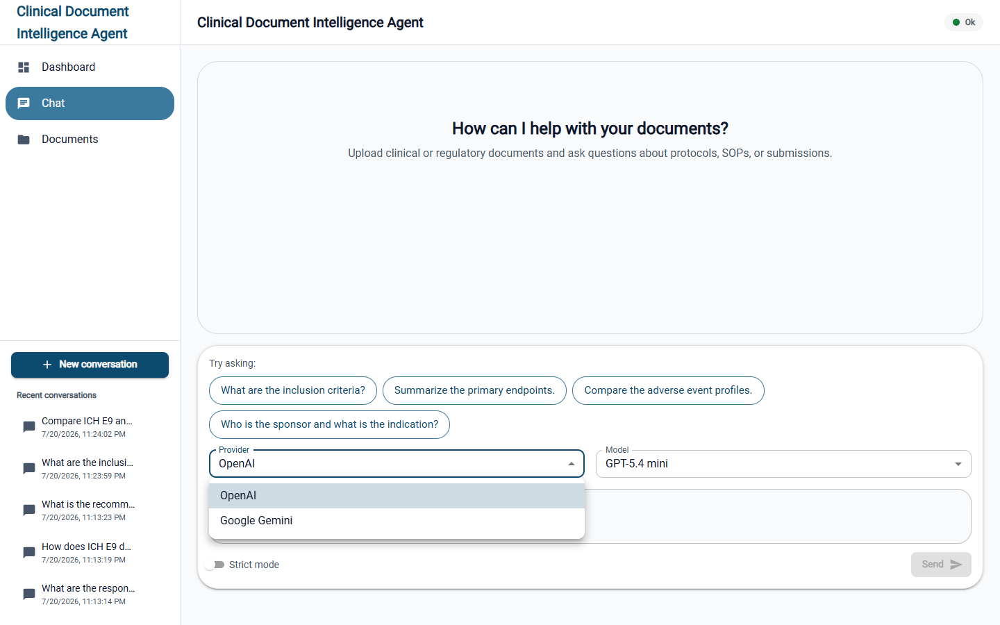
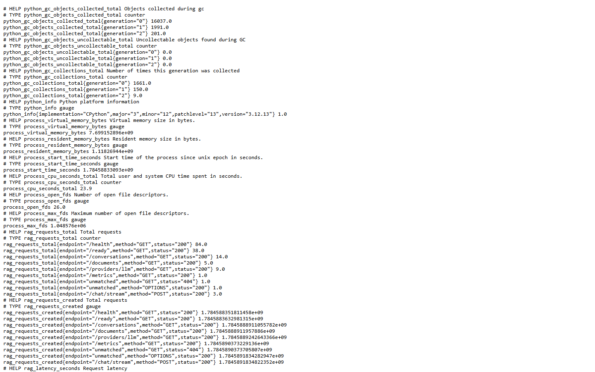

# Clinical Document Intelligence Agent

A full-stack RAG application for clinical and regulatory document intelligence, built as a technical assessment for Newpage Solutions (client: Pfizer).

## Product Angle

This is not a generic "chat with your PDFs" tool. It is designed as a **Clinical & Regulatory Document Intelligence Agent** for life sciences teams — helping compliance, clinical research, and medical affairs professionals get verifiable answers from protocols, SOPs, and regulatory submissions.

Key product differentiators:
- **Source attribution**: every answer cites the document, page, and section.
- **Confidence scoring**: answers are labeled high/medium/low confidence.
- **Audit trail**: every interaction is persisted with sources used.
- **Agent loop**: automatically routes questions to search, compare, extract, or summarize.
- **Guardrails**: the assistant refuses out-of-domain questions and detects PII/PHI.
- **Provider resilience**: retry + fallback for LLM and embedding providers.

## Tech Stack

| Layer | Technology |
|-------|-----------|
| Frontend | Next.js 14 (App Router) + React + Material UI |
| Styling | Material UI v6 + Tailwind CSS utilities |
| Backend | FastAPI + Python 3.12 |
| Architecture | Monolithic hexagonal / DDD |
| Database | PostgreSQL 16 + pgvector |
| Search | PostgreSQL Full-Text Search + pgvector (hybrid retrieval) |
| LLMs | OpenAI and Google Gemini — model catalog in `backend/models.yaml`, selectable per request from the UI |
| Embeddings | BAAI/bge-small-en-v1.5 via sentence-transformers (free, local, 384 dimensions) |
| Async workers | Celery + Redis |
| Containers | Docker + Docker Compose |
| Tests | pytest + pytest-asyncio (backend), Jest + React Testing Library (frontend) |
| Evals | LLM-as-judge (faithfulness + relevance) |

## Quick Start

### Prerequisites

- Docker Desktop installed and running
- API keys for at least one LLM provider (OpenAI or Google)
- No API key is required for embeddings (the default BGE model is downloaded locally)

### Setup

1. Clone the repository and navigate to the project root.

2. Copy the environment file and add your API keys:
   ```bash
   cp .env.example .env
   # Edit .env and add your API keys
   ```

3. Start all services:
   ```bash
   docker-compose up --build -d
   ```
   The backend entrypoint automatically enables the `pgvector` extension, runs Alembic migrations, and seeds the 6 real sample documents.

4. Open the application:
   - Frontend: http://localhost:3000
   - Backend API: http://localhost:8000
   - API docs: http://localhost:8000/docs
   - Health: http://localhost:8000/health
   - Readiness: http://localhost:8000/ready (checks database, Redis, and provider configuration)
   - Metrics: http://localhost:8000/metrics

> **Note:** The `frontend` service is built as a production-optimized standalone image. For local development with hot reload, use `npm run dev` inside `frontend/` or use `frontend/Dockerfile.dev`. The backend image is a multi-stage build (dependencies are compiled in a builder stage; the runtime image ships no build tooling). The backend, worker, and frontend containers all run as non-root users.

## Usage

1. Upload clinical or regulatory documents (PDF, TXT, or DOCX) on the **Documents** page.
2. Wait for the document status to change to `completed` (polling updates automatically). If processing fails, use the retry button on the document card to reprocess it.
3. Start a new chat or continue an existing conversation on the **Chat** page; a new chat offers suggestion chips with example questions.
4. Ask questions in natural language; responses stream in token-by-token (a stop button aborts an in-flight stream).
5. Review source citations, confidence scores, detected intent, and model attribution for each answer; click a citation chip to see the source excerpt.
6. Select the LLM provider and model per request from the chat input.
7. Enable **Strict mode** to force the assistant to refuse answers that are not high-confidence.
8. Open a document from the list to see its detail page, download the original file, or delete documents and conversations when no longer needed.

## Screenshots & Demo

> Screenshots live in `docs/screenshots/`, captured against the running stack at 1440x900.

| Screenshot | What it shows |
|---|---|
|  | Dashboard with document/conversation stats and backend status pill |
|  | Document upload (drag & drop) and processing status transitions |
|  | Streaming answer with confidence / intent / model chips |
|  | Inline citation chips and the citation modal with the source excerpt |
|  | Multi-document comparison answer in the chat, routed by the agent loop |
|  | Strict mode refusing a low-confidence answer |
|  | Per-request LLM provider / model selection |
|  | `/ready` checks and Prometheus metrics at `/metrics` |

**Demo video (2–3 min suggested script):** upload a document → watch it transition to `completed` → ask a factual question with streaming → open a citation → ask a cross-document comparison question in the chat → enable strict mode and re-ask → show `/metrics`.

## Sample Documents (Seed Data)

The backend entrypoint automatically downloads and indexes a curated set of **real, publicly available** clinical/regulatory documents on first startup:

- **ICH E6(R2) GCP** — Good Clinical Practice
- **ICH E8(R1)** — General Considerations for Clinical Studies
- **ICH E9** — Statistical Principles for Clinical Trials
- **ICH E9(R1)** — Estimands and Sensitivity Analysis
- **FDA Informed Consent Guidance** — for IRBs, Clinical Investigators, and Sponsors
- **ClinicalTrials.gov protocol NCT04084769** — Sanofi quadrivalent meningococcal vaccine study

The document list and URLs are stored in `backend/scripts/seed_documents.json`. The seed script is idempotent: if a document with the same filename already exists, it is skipped.

To seed manually:

```bash
docker-compose exec backend python -m scripts.seed_documents
```

To disable automatic seeding, edit `backend/scripts/entrypoint.sh` and remove the `python -m scripts.seed_documents` line.

> **Note:** document processing runs in the background worker and uses the local BGE model, so the first startup may take a few minutes while embeddings are computed.

## API Highlights

- `POST /documents` — upload a document (returns 202 Accepted; 413 above `MAX_UPLOAD_SIZE_MB`, 50 MB by default).
- `GET /documents` — list uploaded documents.
- `GET /documents/{id}` — get document status.
- `GET /documents/{id}/download` — download the original file.
- `DELETE /documents/{id}` — delete a document and its indexed chunks.
- `POST /documents/{id}/reprocess` — re-run ingestion for a failed document (returns 202 Accepted; 404 if the document does not exist, 409 if it is not in `failed` status).
- `POST /chat` — ask a question synchronously; accepts `conversation_id` and `strict_mode`.
  - In `strict_mode`, answers with confidence lower than "high" are replaced by a refusal, reducing the risk of hallucinated responses.
- `POST /chat/stream` — ask a question with streaming; returns NDJSON events (`metadata`, `chunk`, `done`, `error`).
  - Both chat endpoints accept optional `provider` and `model` fields to override the active LLM per request (400 if the provider is not configured or the model is not in the catalog).
- `GET /providers/llm` — list configured LLM providers and their catalogued models (powers the provider/model selector in the chat UI).
- `GET /conversations` — list persisted conversations.
- `GET /conversations/{id}` — retrieve conversation history.
- `DELETE /conversations/{id}` — delete a conversation.

## RAG & LLM Approach

### Chunking
- Documents are parsed with PyMuPDF (PDF), python-docx (DOCX), or directly (TXT).
- Text is pre-split on Markdown-style section headers, then split hierarchically: paragraphs first, then sentence boundaries, then words as a last resort.
- Sizes are word-based: `CHUNK_SIZE=512` words with `CHUNK_OVERLAP=50` words of context carried into the next chunk (both configurable via environment variables).
- Each chunk preserves metadata: document ID, page number, section title, and chunk index.

> **Note:** `section_title` is part of the chunk schema, but the current parsers do not populate it yet (page numbers are populated for PDFs). Populating it via heading detection is listed under [What Would Come Next](#what-would-come-next).

### Embeddings
- **Model**: `BAAI/bge-small-en-v1.5` via Hugging Face `sentence-transformers` (384 dimensions, free, runs locally).
- `EMBEDDING_PROVIDER=bge` by default (`huggingface` is accepted as an alias for the same local sentence-transformers path); set to `openai` to use OpenAI embeddings instead.
- Chunks are embedded asynchronously during background ingestion.

> **Warning:** the vector column dimension comes from `settings.embedding_dimension` (384 for BGE, 1536 for OpenAI). Switching embedding providers requires recreating the database (or regenerating the Alembic migration) so the column matches the new dimension.

### Retrieval
- **Hybrid search** combining:
  - PostgreSQL Full-Text Search (BM25-like keyword matching)
  - pgvector cosine similarity
- Scores are combined with a configurable weight (`hybrid_alpha`).
- Only chunks from `completed` documents are returned (chunks from `processing`/`failed` documents are excluded).

### Agent Loop
- A lightweight router (one extra LLM call for intent classification) classifies each question into:
  - `search` — standard RAG Q&A
  - `compare` — compare two or more documents
  - `extract` — extract structured regulatory entities
  - `summarize` — summarize a section or document
- The router prompt asks for a strict JSON object; the output is validated with Pydantic and any parse/validation failure falls back to `search`, so a router failure never breaks the conversation.
- When the conversation has history, the question is first rewritten into a standalone query with a second extra LLM call (query contextualization, temperature 0.0) that resolves pronouns and references against previous turns, so follow-up questions stay on-topic.
- The router can also return a `clarify` intent (e.g. when the knowledge base is empty or the question is not answerable from it): the agent then asks the user to upload documents or specify a document, without calling the generation LLM.
- When retrieval returns zero chunks, the agent answers "I don't have enough information" without calling the generation LLM.
- The router is provider-agnostic and works with OpenAI and Gemini.

### LLM Selection
- Provider-agnostic abstraction supporting OpenAI and Gemini, behind a common `LLMProvider` port (complete + stream).
- Models are defined in a YAML catalog (`backend/models.yaml`), not hard-coded: each entry carries its own defaults (temperature, top-p, JSON-mode support, provider-specific extra params).
- The active provider is set via `LLM_PROVIDER`; the active model defaults to the provider's first catalog entry and can be overridden with `LLM_MODEL` — or per request from the chat UI.
- Fallback provider via `LLM_FALLBACK_PROVIDER` when the primary fails after retries.

### Prompt Engineering
- One system prompt per intent (`search`, `compare`, `extract`, `summarize`), each instructing the model to answer **only** from the provided context.
- Answers must cite inline in the exact format `[Source N]`; the frontend turns those markers into clickable citation chips.
- Explicit fallback behavior: when the context is insufficient, the model must answer "I don't have enough information" instead of guessing.
- All untrusted content (document chunks, conversation history) is wrapped in XML-style delimiters (`sanitize_for_prompt`) and the system prompt instructs the model to treat the tagged content as data, never as instructions — a second layer of prompt-injection defense on top of the regex guardrails.

### Context Management
- Retrieval fetches the top-5 chunks (`RETRIEVAL_TOP_K`); each source is injected with a numbered header (`[Source N] filename, page N, section`) so the model can attribute statements.
- Conversation history is truncated to the last 10 messages; the intent router only sees the last 6.
- Generation runs at `temperature=0.1` (0.0 for the router) to favor factual, reproducible answers.
- **Known limitation:** chunk sizes are measured in words, not tokens, and there is no token-level budget on the assembled prompt. With very large documents the context could grow beyond what I would accept in production — the fix is a token counter (e.g. `tiktoken`/provider tokenizer) that trims chunks and history to a budget before calling the LLM.

### Guardrails
- Refuses to provide personal medical advice (English and Spanish patterns).
- Returns "I don't have enough information" when retrieval returns zero chunks; weak retrieval instead surfaces as a confidence label on the answer (`high` ≥ 0.7, `medium` ≥ 0.4 on the best chunk score), which strict mode can use to refuse non-high-confidence answers.
- Rejects out-of-domain questions (weather, jokes, small talk).
- Detects prompt-injection attempts and PII/PHI patterns (email, SSN, phone) for audit logging.

### Rate Limiting
- Simple in-memory sliding-window rate limiter (per client IP):
  - Chat endpoints: 30 requests/minute.
  - Document uploads: 10 requests/minute.
- Returns HTTP 429 when the limit is exceeded. For multi-instance deployments this would move to Redis.

> **Known limitation:** guardrails are currently keyword/regex-based. They are sufficient for the demo but would be replaced with a more robust classifier or policy engine in production.

### Quality & Observability
- **Quality controls**: a dedicated evaluation harness (`backend/tests/evals/`) with retrieval recall tests, LLM-as-judge faithfulness and relevance evaluators, and an intent-classification accuracy eval. Evals run deterministically with fake providers by default and can run against a live LLM with `pytest -m llm`. See [Evaluation Harness](#evaluation-harness).
- **Coverage gates in CI**: 60% minimum on the backend (unit + integration) and 70% statements/functions/lines on the frontend Jest suite.
- **Structured logging**: JSON logs via structlog across the API and workers.
- **Metrics**: Prometheus endpoint at `/metrics` with request counters/latency, retrieval latency, LLM token usage per model/provider, fallback activations, and business counters (documents processed, ingestion errors).
- **Health**: `/health` (liveness) and `/ready` (readiness: database, Redis, and provider configuration).
- **Admitted gap**: no distributed tracing (OpenTelemetry) or correlation IDs yet — listed in the skipped standards below.

## Key Technical Decisions (Choices Considered vs Final Choice)

These are the decisions I spent the most time on. For each one I list what I considered, what I finally chose, and why. The full rationale lives in [ARCHITECTURE.md](ARCHITECTURE.md).

| Decision | Considered | Final choice | Why |
|---|---|---|---|
| Vector database | Pinecone, Weaviate, Chroma | **PostgreSQL + pgvector** | One store for relational data, vectors, and full-text search: ACID transactions, and hybrid retrieval in a **single SQL query**. Fewer moving parts to run, secure, and back up. A dedicated vector DB would be justified at a scale this demo doesn't have. |
| Embedding model | `BAAI/bge-m3` (1024-d), OpenAI `text-embedding-3-small` (1536-d) | **`BAAI/bge-small-en-v1.5`** (384-d, local) | Runs locally with no API key and predictable latency — the demo works offline and costs nothing to ingest. I accepted the retrieval-quality trade-off; OpenAI embeddings remain available behind `EMBEDDING_PROVIDER=openai`. |
| LLM integration | Single provider hard-coded | **Provider-agnostic port + YAML model catalog** (OpenAI / Gemini) | Interviewers and users have different keys; a catalog with per-model defaults makes providers interchangeable, and the UI can offer per-request provider/model selection. |
| Provider resilience | Plain SDK calls | **Retry with jittered backoff + fallback provider**, driven by provider-agnostic error classification (retryable vs non-retryable) | LLM APIs fail in specific, classifiable ways (429/5xx vs auth errors). Retrying classified retryable errors (and unknown ones, conservatively) while failing fast on permanent ones avoids burning quota; the fallback keeps the demo alive when a provider goes down. |
| Orchestration | LangGraph, native tool-calling | **Own lightweight intent router** (one JSON classification call, validated with Pydantic) | Tool-calling support is uneven across the three providers (Gemini's API differs most). A router is provider-agnostic, cheap, and — critically — deterministic to test with fake providers. If the agent grew real multi-step tool use, I would revisit LangGraph. |
| Retrieval | Pure vector search | **Hybrid FTS + vector** with weighted fusion (`HYBRID_ALPHA`) | Clinical queries contain exact entities (NCT IDs, section numbers, drug names) where keyword matching beats embeddings; pure vector search misses them. Both legs run as CTEs in one query. |
| Guardrails | ML-based classifier / moderation API | **Layered regex/keyword checks** (injection, out-of-domain, medical advice EN/ES, PII) + XML prompt delimiters + strict mode | Transparent, zero added latency, and sufficient for a demo threat model. Documented as a known limitation with the production replacement path. |
| Conversations storage | One table per message | **JSON blob per conversation** | Reads/writes are always whole conversations; a separate table would add joins for no query benefit at this scale. Trade-off documented in ARCHITECTURE.md. |

## MCP Server

A FastMCP server exposes document intelligence tools:

```bash
cd backend
python -m mcp_server.server
```

Available tools:
- `search_documents(query, top_k)`
- `compare_documents(query, document_names)`
- `extract_entities(query, document_names)` — `document_names` is optional
- `list_documents(limit)` — list ingested documents with their processing status

All tools return JSON and include a readable `error` field instead of raising when something fails.

## Evaluation Harness

Run all tests:

```bash
docker-compose exec backend pytest -v
```

Run retrieval evaluation:

```bash
docker-compose exec backend pytest tests/evals -v
```

The harness now includes:
- Retrieval recall tests.
- LLM-as-judge faithfulness evaluator.
- LLM-as-judge answer relevance evaluator.
- Intent-classification accuracy eval (deterministic with fake providers; live with `pytest -m llm`).
- Live end-to-end RAG quality eval (`tests/evals/test_rag_quality.py`): faithfulness + relevance of real answers, citation discipline, and out-of-context refusal — runs with `pytest -m llm` and a configured API key.

Known limitations of the eval harness:
- The retrieval recall test uses keyword containment with the query embedding mocked to a constant (deterministic): it exercises the FTS leg and the fusion plumbing, not vector-ranking quality. The dataset's `expected_chunk_ids` field is reserved for a future recall@k metric.
- The faithfulness/relevance evaluators run with a fake judge in CI; judging real pipeline answers requires `pytest -m llm` plus an API key, so it is not part of CI.
- The retrieval dataset covers a single seeded document; multi-document comparison recall is not measurable yet.

For manual end-to-end verification, see [MANUAL_TEST_SCENARIOS.md](MANUAL_TEST_SCENARIOS.md) — scripted scenarios (factual grounding, citations, strict mode, comparison) with UI steps and curl commands.

Frontend tests (Jest + React Testing Library, ~70% coverage floor):

```bash
cd frontend
npm test                # or: npm run test:coverage
```

## Architecture

```
┌─────────────────┐      ┌──────────────────────┐      ┌─────────────────┐
│   Next.js UI    │──────│   FastAPI Backend    │──────│  PostgreSQL     │
│                 │      │  (Hexagonal / DDD)   │      │  + pgvector     │
└─────────────────┘      └──────────────────────┘      └─────────────────┘
                                │
                    ┌───────────┴───────────┐
                    ▼                       ▼
            ┌──────────────┐        ┌──────────────┐
            │ Celery Worker│        │  Redis Queue │
            └──────────────┘        └──────────────┘
```

See [ARCHITECTURE.md](ARCHITECTURE.md) for detailed design decisions, and [docs/ARCHITECTURE.md](docs/ARCHITECTURE.md) for a higher-level overview with a Mermaid diagram and the database schema.

## Engineering Standards

- Clean architecture with domain/application/infrastructure separation.
- Repository pattern for data access.
- Async-first backend with SQLAlchemy 2.0.
- Environment-based configuration with Pydantic Settings.
- Structured logging with structlog.
- Prometheus metrics for requests, latency, retrieval, tokens, fallbacks, and business events (documents processed, ingestion errors).
- Idempotent document processing: Celery tasks skip already-completed documents and re-ingestion replaces chunks instead of duplicating them.
- Resilient providers: errors are classified as retryable/non-retryable, retries use exponential backoff with jitter (`base + uniform(0, base)`; unknown errors are retried conservatively), and clients have configurable timeouts.
- Pre-commit hooks (ruff, ruff-format, mypy) via `backend/.pre-commit-config.yaml`.
- Containerized development environment.

### Standards I consciously skipped (and why)

Being explicit about what I left out is part of the engineering story:

- **Authentication / authorization** (OAuth2/JWT + RBAC): out of scope for a single-user demo. Every endpoint is currently open; this is the first thing production would need.
- **Distributed tracing** (OpenTelemetry) and correlation IDs: metrics + structured logs were enough to debug a two-service demo; tracing becomes essential once the agent loop spans more services.
- **Infrastructure as Code** (Terraform, Kubernetes manifests) and a deploy stage in CI: CI builds and smoke-tests the stack with docker-compose, but images are not pushed to a registry and there is no deployment automation (see the productionization plan below).
- **Distributed rate limiting**: the limiter is in-memory per process, which is wrong for multi-instance deployments. The code comments say so; production would move it to Redis.
- **Token-based context budgeting**: chunks are sized in words and the assembled prompt has no token cap. Fine for the seeded documents; risky for very large ones.
- **Separate messages table**: conversations are stored as a JSON blob (see the decisions table). Message-level queries would require normalizing.

## Productionization Notes

What it would take to productionize, scale, and deploy this solution on a hyper-scaler:

### Target architecture per cloud

- **AWS**: API + workers on ECS/Fargate (or EKS), RDS for PostgreSQL with the pgvector extension, ElastiCache (Redis) as Celery broker, S3 for uploaded files, Secrets Manager for API keys, ALB + ACM in front, CloudWatch + managed Prometheus/Grafana for observability.
- **GCP**: Cloud Run (or GKE) services, Cloud SQL for PostgreSQL (pgvector), Memorystore (Redis), Cloud Storage for uploads, Secret Manager, Cloud Monitoring/Trace.
- **Azure**: Container Apps (or AKS), Azure Database for PostgreSQL (pgvector extension), Azure Cache for Redis, Blob Storage, Key Vault, Azure Monitor/Application Insights.
- **Cloudflare**: a good fit for the *edge* — Pages/Workers for the frontend, Tunnel + WAF + rate limiting in front of the containerized backend. The backend itself is stateful (PostgreSQL/pgvector, Celery workers, local embedding model), so it does not belong in Workers; it would stay on one of the container platforms above behind Cloudflare.

### Scaling strategy

- The FastAPI layer is stateless → scale horizontally behind a load balancer; move the rate limiter to Redis first.
- Celery workers scale independently per queue; ingestion is I/O- and CPU-bound (embedding), so autoscale on queue depth.
- Managed PostgreSQL with read replicas and PgBouncer-style connection pooling; HNSW index parameters tuned per data volume.
- Uploaded files move from local disk to object storage (S3/GCS/Blob) shared by API and workers.
- The embedding model must be loaded **once per process** (singleton), not per request — this is a known fix I'd make before any load test.

### Security & operations

- OAuth2/JWT authentication at the edge, RBAC claims enforced in the API, mTLS between services, secrets in a managed vault with rotation, SAST/DAST and image scanning (Trivy/CodeQL) in CI.
- Full observability: OpenTelemetry traces across API → DB → LLM providers, RED metrics per endpoint, SLOs with alerting.

### CI/CD

- Extend the existing GitHub Actions workflow: push images to a registry, deploy on merge to main, run the eval harness against a staging environment with stored keys.

## AI-Assisted Development

This project was built with AI coding assistants (Kimi/Cursor/Copilot) used through a structured, layered workflow:

1. **Architecture first:** I sketched the bounded contexts, domain models, and ports/adapters before generating code.
2. **Layer-by-layer generation:** AI was used to scaffold domain models, then repositories, then application services, then API routes — reviewing each layer before moving to the next.
3. **Repetitive boilerplate:** repositories, test fixtures, and CRUD patterns were generated from custom snippets/templates and then refined manually.
4. **Critical review:** all prompts, guardrails, eval harness logic, and agent routing were reviewed and adjusted by hand. I did not accept code I could not explain.

**Do's and don'ts I followed:**
- ✅ Use AI for scaffolding and boilerplate, not for architectural decisions.
- ✅ Review every LLM-generated prompt and guardrail for safety and accuracy.
- ✅ Keep generated code small, testable, and aligned with clean architecture.
- ❌ Do not let AI add complexity that is not justified by the requirement.
- ❌ Do not copy-paste LLM outputs into documentation without rewriting them in my own words.

**How I make AI-assisted work repeatable and maintainable:**
- **`AGENTS.md` as living instructions**: the repo carries an agent-facing guide (architecture, commands, conventions, known caveats) that any AI coding assistant reads before touching code. It turns my preferences into versioned, repeatable instructions instead of re-explaining them in every prompt.
- **Guardrails around generated code**: pre-commit hooks (ruff, ruff-format, mypy strict) and CI gates (lint, type-check, coverage floors) act as the safety net — generated code that doesn't meet the bar doesn't merge.
- **Deterministic test patterns**: fake providers and fixture builders (`backend/tests/fixtures/`, `frontend/__tests__/test-utils.tsx`) mean AI-generated tests run deterministically, without API keys or network.
- **Docs in my own words**: the README and ADRs were reviewed and rewritten by me; where they describe trade-offs, they reflect my reasoning, not the model's defaults.

## What Would Come Next

With more time, I would add:
- Real-time document processing status via WebSocket (currently polled every 2s).
- OCR support for scanned PDFs.
- Pagination and search in the UI for documents and conversations (the API already supports `limit`/`offset`).
- More evaluation datasets and automated benchmarks.
- Fine-tuned clinical embeddings.
- Content-type validation by file signature (not just extension/MIME type).
- Running evals in CI using stored API keys or a local judge model.
- Populating `section_title` in chunks via heading detection during parsing.

## License

This is a technical assessment project and not intended for production use without further hardening.
