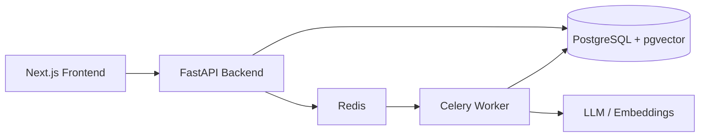

# Architecture Overview

## High-Level Design



## Backend Architecture

The backend follows **hexagonal architecture** with clear separation of concerns:

```
app/
├── api/              # FastAPI routers and schemas
├── application/      # Use cases and services
├── domain/           # Business entities, value objects, ports
├── infrastructure/   # Adapters for DB, LLM, search, storage
└── tasks/            # Celery background tasks
```

### Domain Layer
- `Document`, `Chunk`, `Conversation` entities
- Repository ports (interfaces)
- `LLMProvider`, `EmbeddingProvider`, `FileStorage`, `DocumentParser`, `SearchEngine` ports

### Application Layer
- `DocumentService`: handles uploads, deletes, and triggers async processing
- `IngestionService`: parse → chunk → embed → index pipeline (idempotent)
- `AgentService`: intent router (search / compare / extract / summarize) and answer generation
- `ChatService`: orchestrates guardrails + retrieval + LLM response; supports `strict_mode`
- `ConversationService`: conversation persistence and retrieval
- `guardrails`: out-of-domain, medical-advice, prompt-injection, and PII checks
- `ChunkingService`: splits documents into semantic chunks

### Infrastructure Layer
- `PostgresDocumentRepository`: SQLAlchemy implementation
- `HybridSearchEngine`: combines PostgreSQL FTS + pgvector
- `OpenAIProvider`, `GeminiProvider`
- `LocalFileStorage`: filesystem storage for uploaded files

## Data Flow

1. User uploads document via frontend.
2. FastAPI saves file and metadata, triggers Celery task.
3. Worker parses document, chunks text, generates embeddings.
4. Chunks are stored in PostgreSQL with vector and full-text indexes (`document_id` has a CASCADE foreign key).
5. User asks a question (optionally with `strict_mode`).
6. Backend performs hybrid retrieval over chunks.
7. LLM generates answer with injected context and citations; strict mode rejects low/medium-confidence answers.

## Database Schema

### documents
| Column | Type | Description |
|--------|------|-------------|
| id | UUID | Primary key |
| filename | VARCHAR | Original filename |
| content_type | VARCHAR | MIME type |
| status | ENUM | pending/processing/completed/failed |
| metadata | JSON | Optional metadata |
| error_message | TEXT | Failure reason |
| created_at | TIMESTAMP | Creation time |
| updated_at | TIMESTAMP | Last update |

### chunks
| Column | Type | Description |
|--------|------|-------------|
| id | UUID | Primary key |
| document_id | UUID | Foreign key to documents |
| content | TEXT | Chunk text |
| chunk_index | INT | Order within document |
| page_number | INT | Page number (if available) |
| section_title | VARCHAR | Section heading (if available) |
| embedding | VECTOR(384) | bge-small-en-v1.5 embedding (default; 1536 with OpenAI provider) |
| search_vector | TSVECTOR | Full-text search vector |
| metadata | JSON | Optional metadata |

### conversations
| Column | Type | Description |
|--------|------|-------------|
| id | UUID | Primary key |
| messages | JSON | Chat history |
| metadata | JSON | Optional metadata |
| created_at | TIMESTAMP | Creation time |
| updated_at | TIMESTAMP | Last update |
